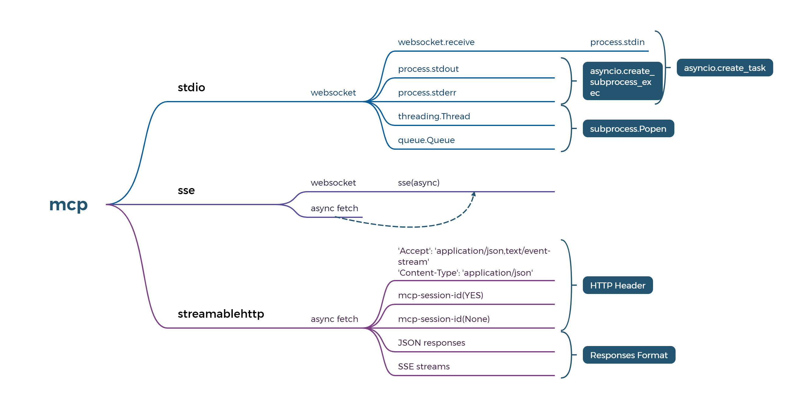
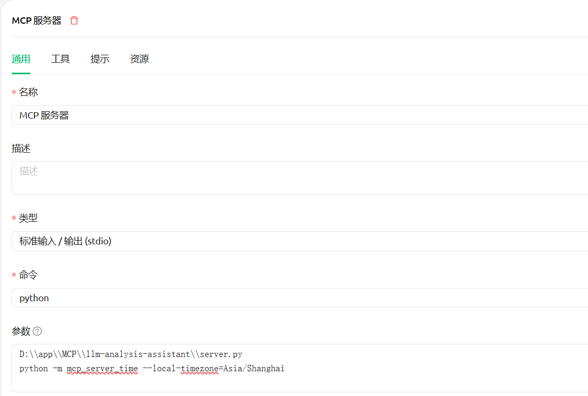
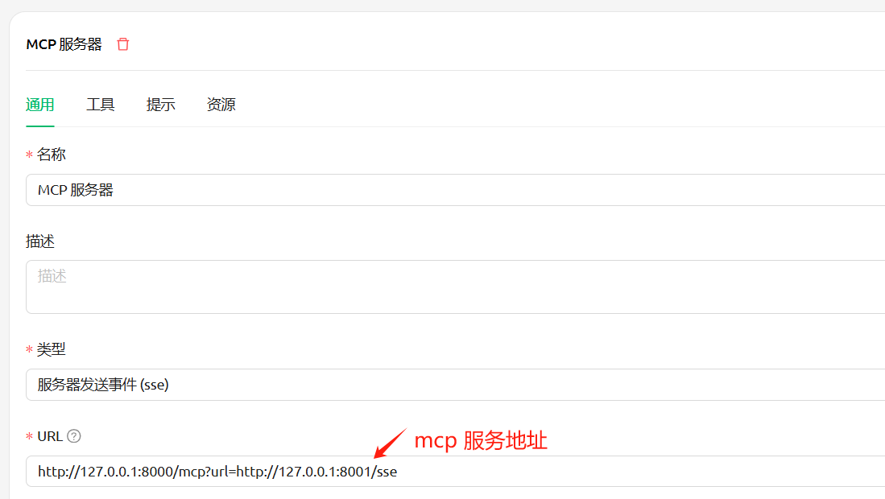
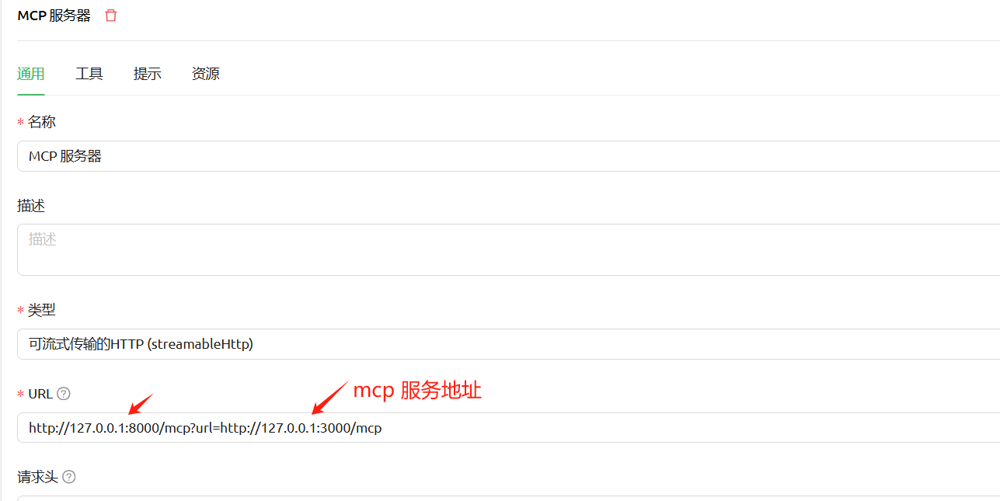

[English](./README.md) | [简体中文](./README_zh.md) 

# 1、Project Features
Through this proxy service, we can easily record the parameters and return results of the interaction with the big model, so as to conveniently analyze the logic of the client calling the big model and deeply understand the phenomenon and its essence.
This project is not for optimizing the big model, but it can help you uncover the mystery of the big model, understand and achieve product market fit (PMF).

MCP is also an important part of LLM, so this project can also be used as an mcp client and supports detection of sse/mcp-streamable-http mode.

# 🌟 Main features
### Function list:
1. **mcp client (already supports stdio/sse/streamableHttp calls)**
2. **mcp initialization detection and analysis (such as Cherry Studio supports stdio/sse/streamableHttp)**
3. **Detect ollama/openai interface and generate analysis log**
4. **mock ollama/openai interface data**

### Technical features:
1. **uv tool use**
2. **uvicorn framework use**
3. **front-end async, back-end async**
4. **log display real-time refresh, breakpoint continuation**
5. **py socket write http client, support get/post, and their respective streaming output**
6. **webSocket combined with asyncio use**
7. **threading/queue use**
8. **py program packaged into exe**

# 2. Project Background
Before the arrival of true AGI, we will have to go through a long journey, during which we will have to face constant challenges. Whether ordinary people or professionals, their lives will be changed.

However, for the use of large models, both ordinary users and developers often indirectly contact them through various clients. But the client often blocks the process of interacting with the large model, and can directly give results based on the user's simple input, giving people a feeling that the large model is mysterious, like a black box. In fact, this is not the case. When using a large model, we simply understand that we are calling an interface with input and output.
It should be noted that although many inference platforms provide OpenAI format interfaces, their actual support varies. Simply put, the request parameters and return parameters of the API are not exactly the same.

For detailed parameter support, please see

[Semi-standard:OpenAI API](https://platform.openai.com/docs/api-reference/responses/create)

[n development:OLLAMA API](https://github.com/ollama/ollama/blob/main/docs/openai.md#supported-features)

[in production:VLLM API](https://docs.vllm.ai/en/stable/api/inference_params.html#sampling-parameters)

Please check for other platforms

### This project uses the uvicorn framework to start asgi to provide API services, with minimal dependencies, running quickly and concisely, paying tribute to the classics

# 3. Installation

```sh

# clone git
git clone https://github.com/xuzexin-hz/llm-analysis-assistant.git
cd llm-analysis-assistant

# Install the extension
uv sync

```

# 4. Use
Enter the root directory, then the bin directory
Click run-server.cmd to start the service
Click run-build.cmd to package the service into an executable file (in the dist directory)
Or run the following command directly in the root directory:

```sh

#Default port 8000
python server.py

#You can also specify the port
python server.py --port=8001

#You can also specify the openai address, the default is the ollama address: http://127.0.0.1:11434/v1/
python server.py --base_url=https://api.openai.com
#If you configure other api addresses, remember to fill in the correct api_key, ollama does not need api_key by default

#--is_mock=true Turn on mock and return mock data
python server.py --is_mock=true

#--mock_string, you can customize the returned mock data, if you do not set this item, the default mock data will be returned. This parameter also applies to non-streaming output
python server.py --is_mock=true --mock_string=Hello

#--mock_count, the number of times the mock returns data when streaming output, the default is 3 times
python server.py --is_mock=true --mock_string=Hello --mock_count=10

#--single_word, mock streaming output return effect, the default is to divide a sentence into 3 parts according to [2:5:3] and return them in sequence, after setting the second parameter, it will be a word-by-word streaming output effect
python server.py --is_mock=true --mock_string=你好啊 --single_word=true

#--looptime, mock streaming output return data interval, the default is 0.35 seconds, set looptime=1 when streaming output display data speed will be slow
python server.py --is_mock=true --mock_string=你好啊 --looptime=1

```

http://127.0.0.1:8000/logs View logs in real time

# Detection, analysis and call mcp (currently supports stdio/sse/streamableHttp)

The implementation logic of mcp client technology is as follows. The interface log seems to be a sequential request, but it is not actually a simple request-response mode. This is easier for users to understand



mcp-sse logic details (for similarities and differences with stdio/streamableHttp, please refer to other materials)


# Detection and analysis of mcp-stdio
Open the following address in the browser. In the command line, ++user=xxx means that the system variable is user and the value is xxx

http://127.0.0.1:8000/mcp?url=stdio

Or use Cherry Studio to add the stdio service



# Detection and analysis of mcp-sse
Open the following address in the browser, the url is the sse service address

http://127.0.0.1:8000/mcp?url=http://127.0.0.1:8001/sse

Or use Cherry Studio to add the mcp service



# Detection and analysis of mcp-streamable-http
Open the following address in the browser, the url is the streamableHttp service address

http://127.0.0.1:8000/mcp?url=http://127.0.0.1:8001/mcp

Or use Cherry Studio to add the mcp service



When using Cherry Studio, you can http://127.0.0.1:8000/logs View the logs in real time to analyze the calling logic of sse/mcp-streamable-http

# 5. Example collection
Change the base_url of openai to the address of the service: http://127.0.0.1:8000
### ⑴. Analyze langchain
### Install langchain first:
```sh

pip install langchain langchain-openai

```

```sh

from langchain.chat_models import init_chat_model
model = init_chat_model("qwen2.5-coder:1.5b", model_provider="openai",base_url='http://127.0.0.1:8000',api_key='ollama')
model.invoke("Hello, world!")

```
##### After running the above code, if you want to view the log file, you can enter the corresponding day folder in the logs directory to view it. There is a log file for each request
##### Open [http://127.0.0.1:8000/logs](http://127.0.0.1:8000/logs) to view the logs in real time

### ⑵Analysis tool set
#### 1. Tool Open WebUI
[Open WebUI.md](docs/Open%20WebUI.md)

#### 2. Tool Cherry Studio
[Cherry Studio.md](docs/Cherry%20Studio.md)

#### 3. Tool continue
[continue.md](docs/continue.md)

#### 4. Tool Navicat
[Navicat.md](docs/Navicat.md)

### ⑶、Analysis agent
#### 1. Agent Multi-Agent Supervisor

####### Agent is a node, agent is a tool, leader mode


[langgraph-supervisor.md](docs/langgraph-supervisor.md)

#### 2. Intelligent agent Multi-Agent Swarm
###### Professional matters are reliable when handed over to professionals, teamwork mode


[langgraph-swarm.md](docs/langgraph-swarm.md)

#### 3. Intelligent agent codeact
####### Every inch has its own strengths and weaknesses (it is said that CodeAct will greatly improve accuracy and efficiency in some scenarios)


[langgraph-codeact.md](docs/langgraph-codeact.md)

# License
[Apache 2.0 License.](LICENSE)