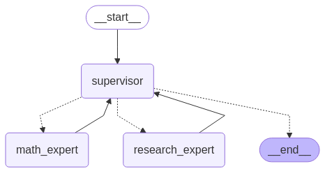
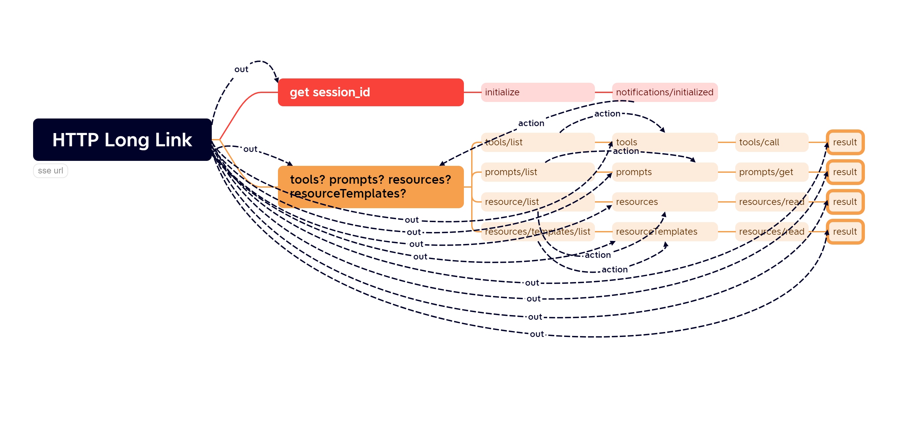

# 1、项目功能(llm logs analysis)
通过启用该代理服务，我们能够轻松记录每次和大模型交互的参数及其返回结果，从而便捷地分析客户端调用大模型的逻辑，实现对现象的理解和本质的透彻认识，做到知其然也知其所以然。
本项目不是为了优化大模型的,但可以助你理解并实现PMF

# 2、项目背景
在真正的AGI到来之前，我们必将经历一段漫长的旅程，期间需要不断面对挑战，无论是普通人还是专业人士，生活都将因此而改变。

然而，对于大模型的使用，无论是普通用户还是开发人员，往往都是通过各种客户端间接接触的。但客户端往往屏蔽了和大模型交互的过程，可以直接根据用户的简单输入，
就给出结果，给人一种感觉就是大模型很神秘，像黑盒一样。 实际不是这样的，使用大模型，简单理解我们就是在调用一个接口，有输入输出罢了。
需要注意的是，尽管许多推理平台提供了OpenAI格式的接口，但它们的实际支持情况各不相同，简单来说，API的请求参数和返回参数并不完全一致。

若想了解详细参数支持情况，请看

[准标准:OpenAI API](https://platform.openai.com/docs/api-reference/responses/create)

[开发环境常用:OLLAMA API](https://github.com/ollama/ollama/blob/main/docs/openai.md#supported-features)

[生产环境常用:VLLM API](https://docs.vllm.ai/en/stable/api/inference_params.html#sampling-parameters)

其他平台请自行查阅

### 本项目采用python的uvicorn启动asgi提供API服务，以最小的依赖，快速而简洁地运行，致敬经典

# 3、安装所需扩展

```sh

pip install uvicorn

```

# 4、用法
进入根目录，然后进入bin目录
点击run-server.bat,就可以启动服务

或者在跟目录直接运行:
```sh

#默认8000端口
python server.py

#也可以指定端口
python server.py --port=8001

#也可以指定openai地址,默认是ollama的地址：http://127.0.0.1:11434/v1/
python server.py --base_url=https://api.openai.com
#若配置其他api地址，记得要填写准确的api_key,ollama默认是不需要api_key的

#-mock true or --is_mock true 开启mock，可以返回模拟数据
python server.py --is_mock true

#--mock_string，可以自定义返回模拟数据，不设置此项就会返回默认mock数据
python server.py --is_mock true --mock_string 你好啊

#--mock_count，mock流式输出时返回数据的次数，默认3次
python server.py --is_mock true --mock_string 你好啊 --mock_count 10

```

启动该服务后当请求到该服务时，logs目录中会根据日期创建一个文件夹，里面就是详细的日志
# 5、例子集合
统一把openai的base_url改成该服务的地址：http://127.0.0.1:8000
### ⑴、 分析langchain
### 先安装langchain:
```sh

pip install langchain langchain-openai

```

```sh

from langchain.chat_models import init_chat_model
model = init_chat_model("qwen2.5-coder:1.5b", model_provider="openai",base_url='http://127.0.0.1:8000',api_key='ollama')
model.invoke("Hello, world!")

```
##### 运行上面代码后，要想查看日志文件，可以进入logs目录对应天数文件夹中查看，每一个请求一个log文件
##### 打开[http://127.0.0.1:8000/logs](http://127.0.0.1:8000/logs)可实时查看日志

### ⑵分析工具集
#### 1、工具Open WebUI
[Open WebUI.md](docs/Open%20WebUI.md)

#### 2、工具Cherry Studio
[Cherry Studio.md](docs/Cherry%20Studio.md)

#### 3、工具continue
[continue.md](docs/continue.md)

#### 4、工具Navicat
[Navicat.md](docs/Navicat.md)

### ⑶、 分析智能体
#### 1、智能体 Multi-Agent Supervisor

###### agent即节点，agent即工具，领导者模式



[langgraph-supervisor.md](docs/langgraph-supervisor.md)

#### 2、智能体 Multi-Agent Swarm
###### 专业的事交给专业的人才可靠，团队合作模式


[langgraph-swarm.md](docs/langgraph-swarm.md)

####  3、智能体 codeact
###### 尺有所短,寸有所长嘛(据说CodeAct在一些场景下准确性和效率会大幅提高)


[langgraph-codeact.md](docs/langgraph-codeact.md)

# 分析并简单调用mcp(目前支持sse协议)
例如打开下面地址，url为sse服务地址

http://127.0.0.1:8000/sse?url=http://127.0.0.1:3001/sse



# License
[Apache 2.0 License.](LICENSE)