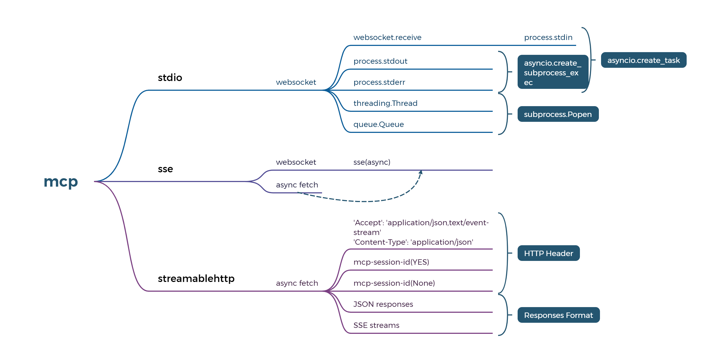
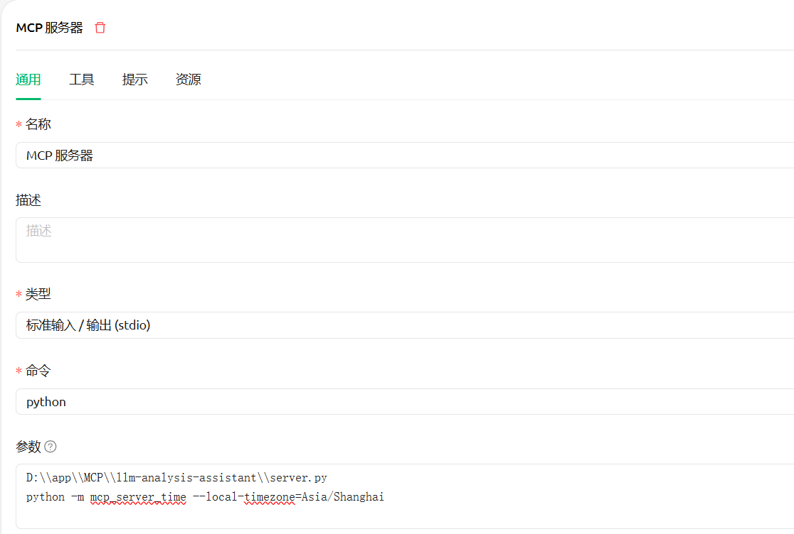
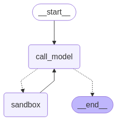

[English](./README.md) | [简体中文](./README_zh.md) 

# 1、项目功能
通过该代理服务，我们能够轻松记录和大模型交互的参数及其返回结果，从而便捷地分析出客户端调用大模型的逻辑，深入理解现象及其本质。
本项目不是为了优化大模型的,但可以助你揭开大模型的神秘面纱,理解并实现产品市场契合（PMF）

MCP也是LLM中重要的一环,故此项目也可当用做mcp客户端使用,并支持对sse/mcp-streamable-http模式的检测

# 🌟 主要特性
### 功能列表:	
1. **mcp客户端(已支持stdio/sse/streamableHttp调用)**
2. **mcp初始化检测分析(比如Cherry Studio支持stdio/sse/streamableHttp)**
3. **检测ollama/openai接口并生成分析日志**
4. **mock ollama/openai 接口数据**
	
### 技术特点:	
1. **uv工具使用**
2. **uvicorn框架使用**
3. **前端async、后端async**
4. **日志显示实时刷新，断点续联**
5. **py socket写http客户端，支持get/post,及各自流式输出**
6. **webSocket结合asyncio一起使用**
7. **threading/queue使用**
8. **py程序打包成exe**

# 2、项目背景
在真正的AGI到来之前，我们必将经历一段漫长的旅程，期间需要不断面对挑战，无论是普通人还是专业人士，生活都将因此而改变。

然而，对于大模型的使用，无论是普通用户还是开发人员，往往都是通过各种客户端间接接触的。但客户端往往屏蔽了和大模型交互的过程，可以直接根据用户的简单输入，
就给出结果，给人一种感觉就是大模型很神秘，像黑盒一样。 实际不是这样的，使用大模型，简单理解我们就是在调用一个接口，有输入输出罢了。
需要注意的是，尽管许多推理平台提供了OpenAI格式的接口，但它们的实际支持情况各不相同，简单来说，API的请求参数和返回参数并不完全一致。

若想了解详细参数支持情况，请看

[准标准:OpenAI API](https://platform.openai.com/docs/api-reference/responses/create)

[开发环境常用:OLLAMA API](https://github.com/ollama/ollama/blob/main/docs/openai.md#supported-features)

[生产环境常用:VLLM API](https://docs.vllm.ai/en/stable/api/inference_params.html#sampling-parameters)

其他平台请自行查阅

### 本项目采用uvicorn框架启动asgi提供API服务，以最小的依赖，快速而简洁地运行，致敬经典

# 3、安装

```sh

# 克隆仓库
git clone https://github.com/xuzexin-hz/llm-analysis-assistant.git
cd llm-analysis-assistant

# 安装扩展
uv sync

```

# 4、使用
进入根目录，然后进入bin目录
点击run-server.cmd,就可以启动服务
点击run-build.cmd,即可把该服务打包成可执行文件(在dist目录中)

或者在跟目录直接运行以下命令:

```sh

#默认8000端口
python server.py

#也可以指定端口
python server.py --port=8001

#也可以指定openai地址,默认是ollama的地址：http://127.0.0.1:11434/v1/
python server.py --base_url=https://api.openai.com
#若配置其他api地址，记得要填写准确的api_key,ollama默认是不需要api_key的

#--is_mock=true 开启mock，可以返回模拟数据
python server.py --is_mock=true

#--mock_string，可以自定义返回模拟数据，不设置此项就会返回默认mock数据.此参数对非流式输出也适用
python server.py --is_mock=true --mock_string=你好啊

#--mock_count，mock流式输出时返回数据的次数，默认3次
python server.py --is_mock=true --mock_string=你好啊 --mock_count=10

#--single_word，mock流式输出时返回效果,默认是把一句话按【2:5:3】分3部分依次返回,设置次参数后就是一个字一个字的流式输出效果
python server.py --is_mock=true --mock_string=你好啊 --single_word=true

#--looptime，mock流式输出时返回数据的间隔时间，默认是0.35秒,设置looptime=1后流式输出时候显示数据速度就会慢
python server.py --is_mock=true --mock_string=你好啊 --looptime=1

```

### 使用 PIP(🌟)

或者，您可以通过 pip 安装 'llm-analysis-assistant':

```
pip install llm-analysis-assistant
```

安装后，您可以使用以下脚本运行它:

```
python -m llm_analysis_assistant
```

http://127.0.0.1:8000/logs 实时查看日志

# 检测分析并调用mcp(目前已支持stdio/sse/streamableHttp)

mcp客户端技术实现逻辑如下,看接口日志似乎是顺序请求,但实际确不是这样的,不是简单的请求-响应模式,这样处理是便于用户理解



mcp-sse逻辑细节(和stdio/streamableHttp的异同点可参考其他资料了解)


# 检测分析mcp-stdio
浏览器打开下面地址,命令行中++user=xxx 表示系统变量是user,值是xxx

http://127.0.0.1:8000/mcp?url=stdio

或者使用Cherry Studio添加stdio服务



# 检测分析mcp-sse
浏览器打开下面地址，url为sse服务地址

http://127.0.0.1:8000/mcp?url=http://127.0.0.1:8001/sse

或者使用Cherry Studio添加mcp服务


# 检测分析mcp-streamable-http
浏览器打开下面地址，url为streamableHttp服务地址

http://127.0.0.1:8000/mcp?url=http://127.0.0.1:8001/mcp

或者使用Cherry Studio添加mcp服务


使用Cherry Studio时可通过 http://127.0.0.1:8000/logs  实时查看日志来分析sse/mcp-streamable-http的调用逻辑

# 5、例子集合
统一把openai的base_url改成该服务的地址：http://127.0.0.1:8000
### ⑴、 分析langchain
### 先安装langchain:
```sh

pip install langchain langchain-openai

```

```sh

from langchain.chat_models import init_chat_model
model = init_chat_model("qwen2.5-coder:1.5b", model_provider="openai",base_url='http://127.0.0.1:8000',api_key='ollama')
model.invoke("Hello, world!")

```
##### 运行上面代码后，要想查看日志文件，可以进入logs目录对应天数文件夹中查看，每一个请求一个log文件
##### 打开[http://127.0.0.1:8000/logs](http://127.0.0.1:8000/logs)可实时查看日志

### ⑵分析工具集
#### 1、工具Open WebUI
[Open WebUI.md](docs/Open%20WebUI.md)

#### 2、工具Cherry Studio
[Cherry Studio.md](docs/Cherry%20Studio.md)

#### 3、工具continue
[continue.md](docs/continue.md)

#### 4、工具Navicat
[Navicat.md](docs/Navicat.md)

### ⑶、 分析智能体
#### 1、智能体 Multi-Agent Supervisor

###### agent即节点，agent即工具，领导者模式


[langgraph-supervisor.md](docs/langgraph-supervisor.md)

#### 2、智能体 Multi-Agent Swarm
###### 专业的事交给专业的人才可靠，团队合作模式


[langgraph-swarm.md](docs/langgraph-swarm.md)

####  3、智能体 codeact
###### 尺有所短,寸有所长嘛(据说CodeAct在一些场景下准确性和效率会大幅提高)



[langgraph-codeact.md](docs/langgraph-codeact.md)

# License
[Apache 2.0 License.](LICENSE)