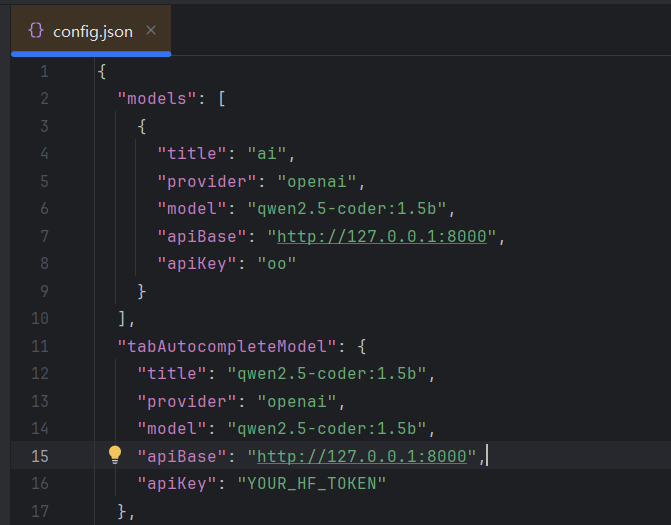
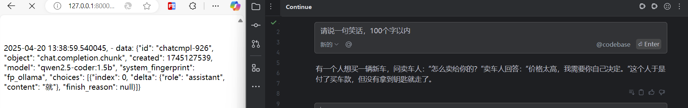

## 1、若没听说过continue，请查看[continue介绍](https://www.continue.dev/),continue是第一完整支持MCP的Resources、Prompts、Tools功能的代码插件

#### 若想了解MCP的客户端支持情况，请看[View the list of clients that support MCP integrations](https://modelcontextprotocol.io/clients)

## 2、api地址一定要写该项目的地址：http://127.0.0.1:8000

## 3、请仔细观察下图，右边是日志页面，聊天过程中，日志会实时更新

