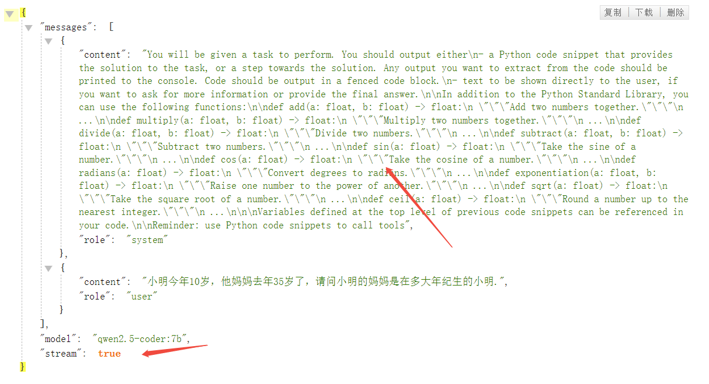

```sh

pip install langgraph-codeact langchain-openai

```
###### 工具直接放到提示中，准确率和效率仁者见仁智者见智



```sh

import math

from langchain_core.tools import tool

def add(a: float, b: float) -> float:
    """Add two numbers together."""
    return a + b

def multiply(a: float, b: float) -> float:
    """Multiply two numbers together."""
    return a * b

def divide(a: float, b: float) -> float:
    """Divide two numbers."""
    return a / b

def subtract(a: float, b: float) -> float:
    """Subtract two numbers."""
    return a - b

def sin(a: float) -> float:
    """Take the sine of a number."""
    return math.sin(a)

def cos(a: float) -> float:
    """Take the cosine of a number."""
    return math.cos(a)

def radians(a: float) -> float:
    """Convert degrees to radians."""
    return math.radians(a)

def exponentiation(a: float, b: float) -> float:
    """Raise one number to the power of another."""
    return a**b

def sqrt(a: float) -> float:
    """Take the square root of a number."""
    return math.sqrt(a)

def ceil(a: float) -> float:
    """Round a number up to the nearest integer."""
    return math.ceil(a)

tools = [
    add,
    multiply,
    divide,
    subtract,
    sin,
    cos,
    radians,
    exponentiation,
    sqrt,
    ceil,
]
import builtins
import contextlib
import io
from typing import Any


def eval(code: str, _locals: dict[str, Any]) -> tuple[str, dict[str, Any]]:
    # Store original keys before execution
    original_keys = set(_locals.keys())

    try:
        with contextlib.redirect_stdout(io.StringIO()) as f:
            exec(code, builtins.__dict__, _locals)
        result = f.getvalue()
        if not result:
            result = "<code ran, no output printed to stdout>"
    except Exception as e:
        result = f"Error during execution: {repr(e)}"

    # Determine new variables created during execution
    new_keys = set(_locals.keys()) - original_keys
    new_vars = {key: _locals[key] for key in new_keys}
    return result, new_vars
from langchain.chat_models import init_chat_model
from langgraph_codeact import create_codeact
from langgraph.checkpoint.memory import MemorySaver

model = init_chat_model("qwen2.5-coder:7b", model_provider="openai",base_url='http://127.0.0.1:8000',api_key='openai')

code_act = create_codeact(model, tools, eval)
agent = code_act.compile(checkpointer=MemorySaver())

messages = [{
    "role": "user",
    "content": "小明今年10岁，他妈妈去年35岁了，请问小明的妈妈是在多大年纪生的小明."
}]
for typ, chunk in agent.stream(
    {"messages": messages},
    stream_mode=["values", "messages"],
    config={"configurable": {"thread_id": 1}},
):
    if typ == "messages":
        print(chunk[0].content, end="")
    elif typ == "values":
        print("\n\n---answer---\n\n", chunk)
        
```